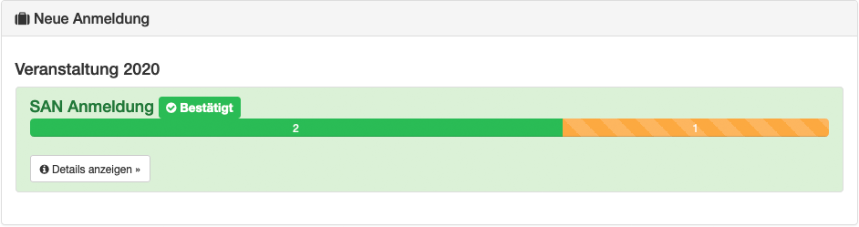

Anmeldung von Personal
======================

Möchte ein Teilnehmer eine neue Teilnahmewunsch für eine Veranstaltung stellen, so kann er dieses im geschlossenen Bereich tun. Anschließend kann er sich für eine Rolle anmelden.

Damit die Rollen für den Teilnehmer sichtbar sind, muss zum einen die Registrierung für das aktuelle Datum erlaubt sein und genügend freie Rollen zur Verfügung stehen. Siehe  :ref:`Schicht Erstellung <personal_shift>`.

Neue Anmeldung
--------------

Für eine erfolgreiche Anmeldung sind folgende Felder pflicht:

- Anreisedatum
- T-Shirt Größe
- KFZ-Kennzeichen
- Schicht (mindestens eine)

Bei den Schichten ist zu beachten, dass zwischen zwei Schichten mindestens 12 Stunden Pause liegen.

Freiwillig können noch eine Bankverbindung für die Abrechnung und eine Organisation angeben werden. Je nach technischer Einstellungen können nur fest definierte Organisation genutzt werden oder diese frei eingegeben werden.

Nach der Anlagen wird außerdem ein aktueller Snapshot von vorher definierten Profilfelder angelegt un mit der Anmeldung abgelegt. Dieser Snapshot bleitb bestehen, egal ob der Telnehmer nach der Anmeldung sein Profil ändert oder nicht.

.. note::

    Pro Rolle und Teilnehmer kann nur eine Anmeldung zu einer Veranstaltung erfolgen. Mehrere Anmeldungen mit verschiedenen Rollen sind jedoch für einen Teilnehmer möglich.

Anmeldung bearbeiten
--------------------

Je nach Einstellung kann ein Teilnehmer seine Anmeldung im Nachgang bearbeiten. Siehe  :ref:`Schicht Erstellung <personal_shift>`.

Anmeldung prüfen
----------------

Sobald eine Anmeldung durch einen Manager bestätigt wurde, kann ein Teilnehmer dieses in der Übersicht an der Farbe sehen. Grün hinterlegt sind bestätigten Schichten, orange offene und rot abgelehnte Wünsche.

Mit einen Klick auf Details kann der Teilnehmer nochmal die genauen Zeiten der Schichten inkl. An- und Abmeldezeiten nachsehen.
