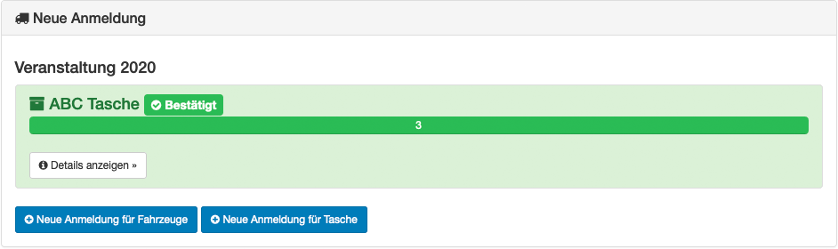

Anmeldung von Verleih
=====================

Die Anmeldung für den Verleih unterliegt weniger Regeln als die für das Personal. Es ist z.B. möglich einen Inventar- / Fahrzeugtyp mehrfach für eine Veranstaltung anzumelden. Auch gibt es keine Bestätigung für einzelne Schichten, sondern nur für ganze Inventargegenstände bzw. Fahrzeuge.

Neue Anmeldung
--------------

Je nach Inventartyp gibt es unterschiedliche Pflichtfelder:

- Inventar besitzt nur ein Kennzeichen
- Fahrzeuge haben weitere Eigenschaften wie Sitzplätze, Gewicht oder Führerscheinklasse.

Jeder Inventartyp benötigt für einen erfolgreiche Anmeldung eine Verfügbarkeit. Hier gibt es keine Einschränkungen für Pausen.

Anmeldung bearbeiten
--------------------

Je nach Einstellung kann ein Anmeldung im Nachgang bearbeiten. Siehe :ref:`Schicht Erstellung <rental_shift>`.

Anmeldung prüfen
----------------

Sobald eine Anmeldung durch einen Manager bestätigt wurde, kann ein Teilnehmer dieses in der Übersicht an der Farbe sehen. Grün bedeutet bestätigtes Inventar, orange noch offene Wünschen.

Mit einen Klick auf Details kann der Teilnehmer nochmal die genauen Zeiten der Schichten inkl. An- und Abmeldezeiten nachsehen.
