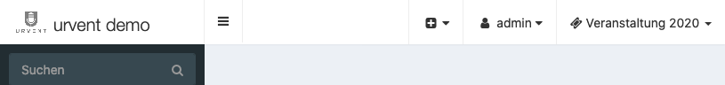

FAQ - Häufige Fragen und Probleme
=================================

.. contents::
   :depth: 2
   :local:

Was ist der Unterschied zwischen einer Qualifikation und einen Nachweis?
------------------------------------------------------------------------

Eine Qualifikation ist eine weitere Unterteilung einer Rolle. Ein Teilnehmer kann nur eine Qualifikation in einer Rolle besitzen.

Nachweise sind Zeugnisse und Zertifikate, die ein Teilnehmer für die Ausübung einer Rolle nachweisen muss. Dieses können z.B. ein Gesundheitszeugnis oder eine Ausschankerlaubnis sein.

Warum verschwinden hinterlegte Qualifikationen, Rollen, ...?
------------------------------------------------------------

Einige hinterlegte Daten im System sind mit einer Veranstaltung verbunden um eine bessere Übersicht zwischen verschiedene Veranstaltungen zu erhalten. Wenn das Veranstaltung in der Verwaltung gewechselt wird, werden nur die für dieses Veranstaltung hinterlegten Werte angezeigt.

Die aktuelle Veranstaltung kann über das Menü in der Verwaltung oben rechts gewechselt werden:

An die Veranstaltung sind folgende Dinge (in)direkt gebunden:

    - Veranstaltung > Rollen
    - Veranstaltung > Einsatzorte
    - Veranstaltung > Teilnehmer
    - Personal > Schichten
    - Personal > Schichtplan
    - Verleih > Inventar
    - Verleih > Fahrzeug
    - Speisekarte > Protokoll
    - Speisekarte > Essenszeiten (nur an Hand des Themen Zeitraums)

Warum ist der Druck der Karten falsch?
--------------------------------------

Beim Druck der Karten ist darauf zu achten, dass das Layout beim Drucker (Portrait oder Landscape) richtig gewählt ist und das der Druck von Hintergrundbildern und Farben aktiviert ist. Dieses ist unter anderem bei Firefox im Normalfall deaktiviert.

Warum sehe ich keine Essenszeiten in der Verwaltung?
----------------------------------------------------

Es werden nur die Essenszeiten angezeigt die in den Zeitraum des Themas fallen. Siehe :ref:`Anfang / Ende des Themas <general_topic>`.

Warum kann sich ein Teilnehmer nicht für eine Veranstaltung anmelden?
---------------------------------------------------------------------

Für eine erfolgreiche Anmeldung sind folgende Dinge erforderlich:

    - Die Registrierung muss für das Theme und die Rolle für das aktuelle Datum erlaubt sein.
    - Es muss mindestens eine wünschbare Schicht vorhanden sein.
    - Es müssen ausreichend freie Plätze für die wünschbaren Schichten vorhanden sein.
    - Mindestens eine Schicht muss in der Zukunft liegen.

Warum erhält der Teilnehmer keine Mahlzeit beim Küchen Scan?
------------------------------------------------------------

Hierfür kann es mehrere Gründe geben:

    - Der Teilnehmer übt zur Zeit keine Schicht aus und hat kein **All You Can Eat**
    - Es sind keine Essenszeiten für die aktuelle Uhrzeit hinterlegt
    - Es sind keine Mahlzeiten für die Essenszeit hinterlegt
    - Der Teilnehmer hat keine Allergie und es sind keine passenden Mahlzeiten hinterlegt

Ich habe versehentlich etwas gelöscht / verändert.
--------------------------------------------------

Aktuell gibt es keine Funktion um etwas rückgängig zu machen.
