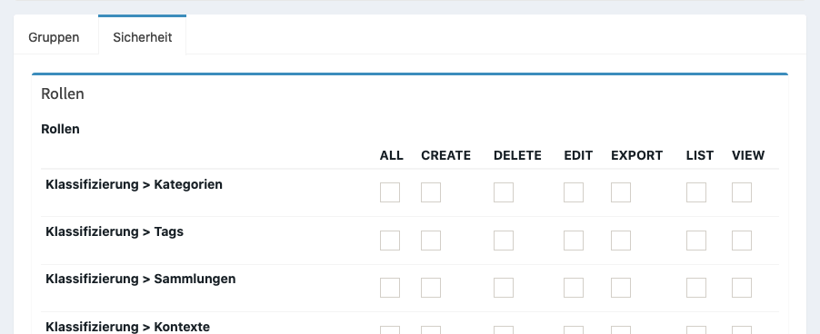

Aufbau des urvent Veranstaltungssystem
======================================

Das System kann in mehreren Komponenten unterteilt werden.

Zugriffsrechte
--------------

Öffentlicher Bereich
    Dieses ist die öffentliche Webseite mit allgemeinen Informationen wie z.B. News, Datenschutzinformationen etc.

Geschlossener Bereich
    Für den Besuch dieses Bereichs muss sich ein Besucher vorher registriert haben. Nach einer erfolgreichen Anmeldung ist es möglich sich für Veranstaltungen anzumelden.

Scanner Terminal
    In diesem Bereich können Teilnehmer- / Verleih-Karten gescannt werden um diese im System an- bzw. abzumelden. Das Terminal ist durch einen Schlüssel geschützt.

    .. note::

        Für die Verwendung des Scanner Terminals wird sowohl ein Kartendrucker (bzw. Aufkleber-Drucker) als auch ein Barcode Scanner benötigt.

Verwaltung
    In diesem Bereich können Administratoren und Manager das System verwalten.

Berechtigungen
~~~~~~~~~~~~~~

In der Verwaltung können Zugriffe auf einzelne Bereiche durch eine Zugriffssteuerung limitiert werden. Zugriffsberechtigungen lassen sich auf Gruppen und Personen anwenden.

.. hint::

    Für die bessere Übersicht und Transparenz werden Gruppen empfohlen.

Über **Benutzer > Gruppen** lassen sich neue Gruppen anlegen und verwalten und anschließend einem Benutzer über **Benutzer > Benutzer**  zugewiesen werden.

Pro (Teil)Bereich können mehrere Rechte über eine Matrix hinzugefügt werden:

:ALL:
    Vollzugriff

:CREATE:
    Erlaubt das Erstellen von neuen Objekten

:DELETE:
    Erlaubt das Löschen von Objekten

:EDIT:
    Erlaubt die Bearbeitung von Objekten

:EXPORT:
    Erlaubt es die Liste von Objekten als Excel oder CSV zu exportieren

:LIST:
    Erlaubt die Listenanzeige

:VIEW:
    Erlaubt das Lesen von Objekten

Neben den allgemeinen Berechtigungen gibt es noch einige allgemeine Berechtigungen:

:ROLE_ADMIN:
    Erlaubt Zugriff auf die Verwaltung

:ROLE_ALLOWED_TO_SWITCH:
    Erlaubt das temporäre Anmelden als anderer Benutzer. Kann zum Nachstellen von Fehlern verwendet werden.

:ROLE_SUPER_ADMIN:
    Vollzugriff auf alle Bereiche in der Verwaltung inkl. aller Funktionen

:ROLE_USER:
    Keine besondere Behandlung

Module
------

Neben einer Unterscheidung der Zugriffsrechte gibt es eine funktionale Trennung nach Modulen. Ein Modul umfasst eine Sammlung von Funktionen für einen speziellen Anwendungszweck (z.B. Fahrzeugverleih). Je nach Konfiguration, stehen folgende Module zur Verfügung:

Personal
~~~~~~~~

Das Personalmodul kann Belegschaften für einzelne Schichten zu verwalten. Teilnehmer können Wünsche für eine Veranstaltung äußern und Manager diese über eine grafische Oberfläche Prüfen und Koordinieren.

Küche
~~~~~

Das Küchenmodul ist einer Erweiterung für das Personalmodul und erlaubt eine Planung für die Kantine. Diese versorgt Teilnehmer während der Schicht mit Mahlzeiten.

Verleih
~~~~~~~

Der Verleih erlaubt eine Verwaltung des Fuhrparks und des Inventars. Bei Bedarf können Teilnehmer Verleihobjekte für eine Veranstaltung anmelden.

