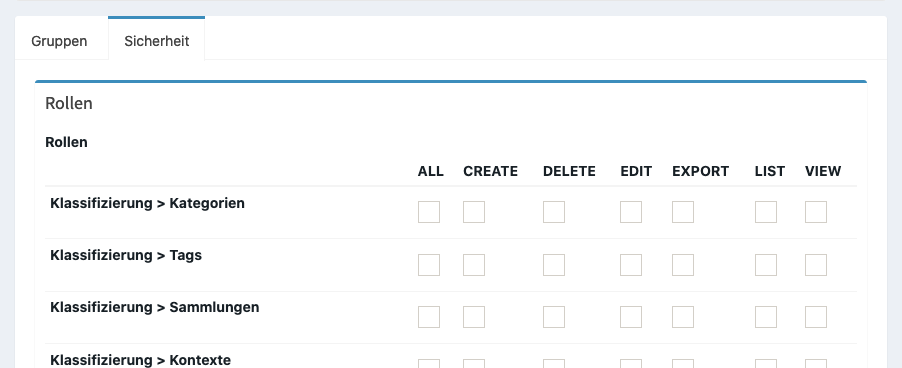

Installation
============

.. contents::
   :depth: 2
   :local:

Anforderungen
-------------

Für den Betrieb der Software wird eine aktuelle PHP Version (PHP 7.4, Stand 02/2020) benötigt, sowie eine MySQL bzw. Maria DB Datenbank. Außerdem wird mindestens 500 MB Speicherplatz für die Installation und hochgeladene Nachweis Dokumente benötigt.

Für einen einfacheren Zugriff und für die Installation von Updates wird ein SSH Zugang benötigt.

Berechtigungen
--------------

In der Verwaltung können Zugriffe auf einzelne Bereiche durch eine Zugriffssteuerung limitiert werden. Zugriffsberechtigungen lassen sich auf Gruppen und Personen anwenden.

.. hint::

    Für die bessere Übersicht und Transparenz werden Gruppen empfohlen.

Über **Benutzer > Gruppen** lassen sich neue Gruppen anlegen und verwalten und anschließend einem Benutzer über **Benutzer > Benutzer**  zugewiesen werden.

Pro (Teil)Bereich können mehrere Rechte über eine Matrix hinzugefügt werden:

:ALL:
    Vollzugriff

:CREATE:
    Erlaubt das Erstellen von neuen Objekten

:DELETE:
    Erlaubt das Löschen von Objekten

:EDIT:
    Erlaubt die Bearbeitung von Objekten

:EXPORT:
    Erlaubt es die Liste von Objekten als Excel oder CSV zu exportieren

:LIST:
    Erlaubt die Listenanzeige

:VIEW:
    Erlaubt das Lesen von Objekten

Neben den allgemeinen Berechtigungen gibt es noch einige allgemeine Berechtigungen:

:ROLE_ADMIN:
    Erlaubt Zugriff auf die Verwaltung

:ROLE_ALLOWED_TO_SWITCH:
    Erlaubt das temporäre Anmelden als anderer Benutzer. Kann zum Nachstellen von Fehlern verwendet werden.

:ROLE_SUPER_ADMIN:
    Vollzugriff auf alle Bereiche in der Verwaltung inkl. aller Funktionen

:ROLE_USER:
    Keine besondere Behandlung
