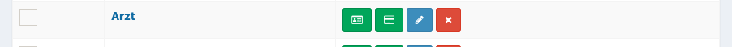

Durchführung einer Veranstaltung
================================

Allgemein
---------

Das folgende Kapitel beschreibt die Verwaltung des Systems während des Veranstaltungszeitraums.

Karte drucken
~~~~~~~~~~~~~

Über **Veranstaltung > Kartenlayout** können spezielle Karten gedruckt werden für die kein Personal oder Fahrzeug hinterlegt ist.

Eigene Karte drucken
^^^^^^^^^^^^^^^^^^^^

Unter Kartenvorschau stehen alle Platzhalter der aktuellen Karte zur Verfügung.

QR-Codes drucken
^^^^^^^^^^^^^^^^

Werden QR-Codes nicht auf den Teilnehmer Karten angezeigt, können fortlaufende QR Codes erstellt werden.

:Start:
    Erste Nummer des Codes

:Schrittweite:
    Abstand zwischen den einzelnen Codes

:Anzahl:
    Anzahl der generierten QR Codes

Module
------

.. toctree::
   :maxdepth: 1

   Personal <personal>
   Küche <kitchen>
   Verleih <rental>
