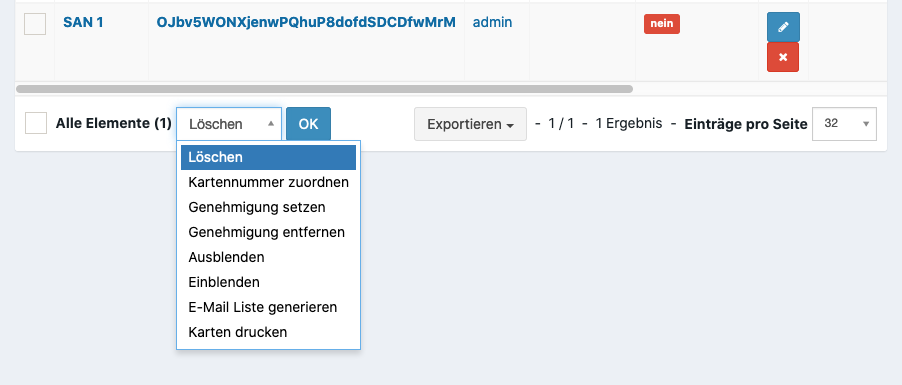
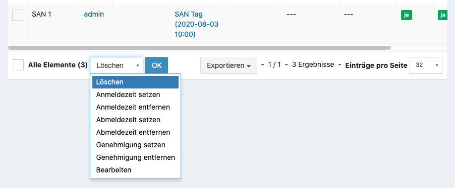
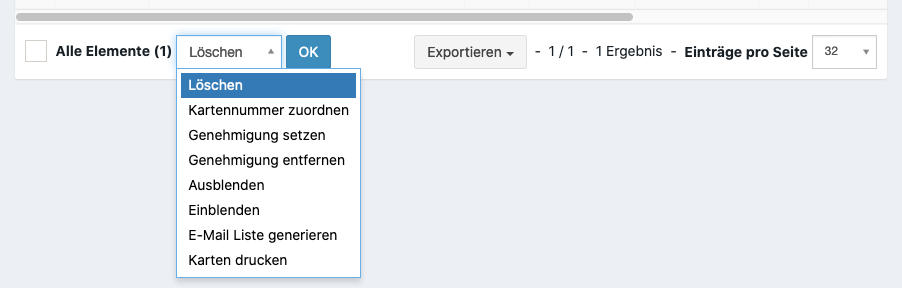

Organisation des Personals
==========================

Einsatzplanung
--------------

Die Zuordnung eines Teilnehmers zu einem Einsatzort für einen Tag kann über **Personal > Einsatzplaner** erfolgen. Nach Auswahl des Datums werden alle Teilnehmer eines Einsatzortes aufgelistet.

Noch nicht zugeordnete Teilnehmer stehen in einer Auswahlbox zur Verfügung. Ebenso können Teilnehmer über das **X** von einem Einsatzort abgezogen werden und anschließend einem neuen Ort zugewiesen werden.

Druck von Personalkarten
------------------------

Sind :ref:`Kartenlayouts <general_cardlayout>` für die Rollen oder Qualifikationen hinterlegt, können Personalkarten für die Teilnehmer über **Veranstaltung > Teilnehmer** gedruckt werden.

In den darauffolgenden Dialog muss das Layout gewählt werden. Dieses erlaubt einen unbeaufsichtigten Druck für mehrere Karten.

Anmelde / Abmeldung Scan
------------------------

Um Teilnehmer im System zu erfassen, die eine manuelle Schichtanmeldung benötigen, kann der Terminal Scanner verwendet werden. Dieser ist z.B. über die Verwaltung unter **Vor Ort** im Widget **Personal Scan** aufzurufen.

In der folgende Maske kann der Barcode der Teilnehmerkarte gescannt werden. Wurde die Karte erkannt, erhält die Person ein visuelles Feedback.

Manuelles Setzen der An- / Abmeldezeit
~~~~~~~~~~~~~~~~~~~~~~~~~~~~~~~~~~~~~~

Meldet sich ein Teilnehmer nach der An- oder Abmeldezeit bei der Verwaltung oder ist das System während der Zeiten nicht erreichbar, kann dieses über **Personal > Schichtplan** nachträglich erfolgen.

Teilnehmer informieren
----------------------

Vor und während der Veranstaltung können Teilnehmer per E-Mail benachrichtigt werden.

Massenmails können aus Spam-Gründen nicht versendet werden, es kann aber über **Veranstaltung > Teilnehmer** eine Liste aller E-Mail Adresse erzeugt werden.

Statistiken
-----------

Zur Überprüfung des reibungslosen Ablaufs, kann dieses an mehreren Stellen kontrolliert werden.

Aktuell Angemeldet
~~~~~~~~~~~~~~~~~~

Zeigt unter Berücksichtigung des aktuellen Datums und der aktuellen Schichten die Teilnehmer an, die gerade im System angemeldet sind einer Tätigkeit nachgehen.

Schicht Statistik
~~~~~~~~~~~~~~~~~

Unter **Personal > Statistik** lassen sich die Anzahl der Teilnehmer für eine Schicht und Datum herausfinden. An dieser Stelle wird auch das Ziel einer Schicht (siehe :ref:`Soll <personal_shift>`) berücksichtigt.

Einsatzplanung
~~~~~~~~~~~~~~

Wie viele Teilnehmer einem Einsatzort zugeordnet ist lässt sich unter **Personal > Einsatzplanung** herausfinden. Damit eine Person einem Einsatzort zugeordnet werden kann, muss der Teilnehmer an diesen Tag eine Schicht absolvieren.

