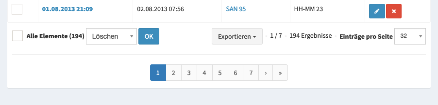

Organisation des Verleihs
=========================

Anmelde / Abmeldung Scan
------------------------

Um Fahrzeuge und Inventar samt Besatzung im System zu erfassen, kann der Terminal Scanner verwendet werden. Dieser ist z.B. über die Verwaltung unter **Vor Ort** im Widget **Fahrzeug Scan** aufzurufen.

In der folgende Maske kann der Barcode der Teilnehmerkarte(n) und einer Verleihkarte gescannt werden. Wurde die Karten erkannt, erhält die Person ein visuelles Feedback.

.. important::

    Für die Anmeldung müssen zunächst alle Teilnehmerkarten gescannt werden und erst am Ende die Verleihkarte.

Abmeldung Scan
~~~~~~~~~~~~~~~

Für die Abmeldung reicht ein Scan der Verleihkarte.

.. warning::

    Wurde eine Fahrzeug / Gegenstand nicht aus dem System abgemeldet, kann dieses nicht erneut besetzt werden.

Manuelles Setzen der Abmeldezeit
~~~~~~~~~~~~~~~~~~~~~~~~~~~~~~~~

Sollte jemand vergessen haben ein Fahrzeug oder ein Gegenstand abzumelden, kann dieses auch im Nachgang über **Verleih > Belegung** erfolgen.

Statistiken
-----------

Die aktuelle Belegung der Fahrzeuge und des Inventars lässt sich unter **Verleih > Aktuelle Belegung**.
