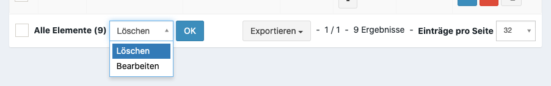

Vorbereitungen für Küchenplanung
================================

(Optional) Anlegen von Merkmalen
--------------------------------

Für Gerichte kännen Merkmale hinterlegt werden, z.B. ob ein Gerich Vegan oder Laktosefrei ist. Neue Merkmale können über **Speisekarte > Merkmale** angelegt werden.

Anlegen von Gerichten
---------------------

Damit ein Teilnehmer vor Ort die Kantine besuchen können, müssen Gerichte im System hinterlegt werden. Neue Gerichte können über **Speisekarte > Gericht** angelegt werden.

:Merkmal:
    Auszeichnung von Gerichten. Dieses ist notwendig, um ein passendes Gerich für einen Teilnehmer zu finden, sollte es mehrere Gerichte zu einer Essenszeit geben.

:Zutaten:
    Für die bessere Bedarfsplanung der Küche können hier einzelne Bestandteile eines Gericht angegeben werden.

Neben diese Felder gibt es noch weitere Metadaten, die für den Druck von komplexen Speisekarten verwendet werden können.

.. _kitchen_mealtime:

Anlegen von Essenszeiten
------------------------

Wenn die :ref:`Schicht Massenanlage <personal_shift_batch>` verwendet wurde, müssen keine weiteren Essenszeiten erfasst werden. Lediglich Gerichte müssen nach den Zeiten zugeordnet werden.

Manuelle Anlage
~~~~~~~~~~~~~~~

Für die Anlage oder Nachbearbeitung kann dieses über **Gericht > Essenszeiten** erfolgen.

:Name:
    Angezeigter Name

:Anfang / Ende:
    Zeitraum zu dem die Küche aufgesucht werden kann

:Gericht:
    Mögliche Gerichte zu dieser Essenszeit.

    :Priorität:
        Bei Konflikten (mehreren möglichen) Gerichten wird die Priorität beachtet. Die kleinste Priorität wird bevorzugt. Dieses sollte nur in selten Fällen auftreten.

Nachträgliches Hinzufügen von Gerichten
~~~~~~~~~~~~~~~~~~~~~~~~~~~~~~~~~~~~~~~

Sollte bei der Anlage einer Essenszeit kein Gericht ausgewählt worden sein, kann dieses nachträglich noch verändert werden. Im unteren Menü der Übersicht können eine oder mehrere Gerichte hinzugefügt werden:

Feldbeschreibung siehe :ref:`Anlegen von Essenszeiten <kitchen_mealtime>`.

:Vorhandene Gerichte ersetzen:
    Entfernt alle Gerichte die bisher zu den ausgewählten Essenszeiten vorhanden waren.

Nachträgliches Hinzufügen von Essenzeiten
~~~~~~~~~~~~~~~~~~~~~~~~~~~~~~~~~~~~~~~~~

Siehe :ref:`Schicht Nachbearbeitung <personal_shift_post_edit>`.

