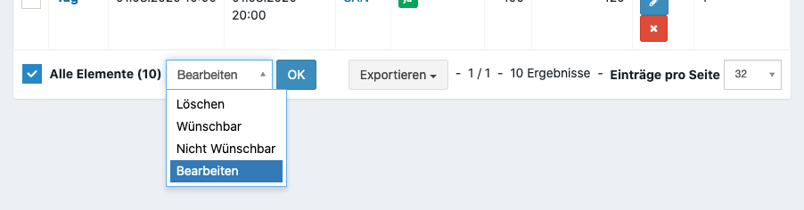

Vorbereitungen für Personal
===========================

.. _personal_qualification:

(Optional) Funktionen anlegen
-----------------------------

Funktionen sind eine Untergruppierung einer Rolle. Angelegt werde diese über **Personal > Funktionen**.

:Kartenlayout:
    Layout das beim Drucken von Teilnehmerkarten verwendet wird. Überschreibt das Layout der Rolle

(Optional) Erfahrungen anlegen
------------------------------

Sind Eigenschaften und Fertigkeiten (z.B. Technischer Funker), die ein Teilnehmer mitbringen kann. Diese kann ein Teilnehmer bei der Anmeldung auswählen und können später zur Filterung verwendet werden. Angelegt werden diese über **Personal > Erfahrungen**.

(Optional) Sprachen anlegen
---------------------------

Gesprochene Sprachen eines Teilnehmers. Ähnliches Handling wie Erfahrungen. Angelegt werden diese über **Personal > Sprachen**.

(Optional) Nachweis Kategorien anlegen
--------------------------------------

Kategorien die ein Teilnehmer beim Hochladen eines Nachweises auswählen kann. Angelegt werden diese über **Benutzer > Nachweis Kategorien"**.

Schichten anlegen
-----------------

Schichten sind Zeitslots in dem ein Teilnehmer seiner Arbeit nachgeht. Während dieser Zeit kann ein Teilnehmer einen Ort zugewiesen sein.

.. _personal_shift:

Manuell
~~~~~~~

Die manuelle Anlage sollte nur in Ausnahmefällen oder zur Nachbearbeitung verwendet werden. In der Regel sollte die :ref:`Massenanlage <personal_shift_batch>` verwendet werden.

Unter **Personal > Schichten** kann eine neue Schicht angelegt werden.

:Name:
    Angezeigter Name

:Rolle:
    Benötigte Rolle um diese Schicht zu absolvieren

:Schichtanfang / -ende:
    Zeitpunkt an dem die Schicht stattfindet

:Anmeldung / Abmeldung:
    Werden hier eine Anfang und Ende Zeit ausgewählt, muss ein Teilnehmer sich zur erfolgreichen Ausführung der Schicht am Veranstaltungstag in diesem Zeitraum im System manuell an- bzw. abmelden. Wird hier keine Zeit ausgewählt, wird die Person automatisch als An- bzw. Abgemeldet im System erkannt.

    Hier gilt die gleiche Logik für Tag und Uhrzeit wie bei dem Schichtanfang bzw. Schichtende.

:Soll:
    Wird nur in der Statistik als interner Merker angezeigt.

:Wünschbar:
    Legt fest, ob ein Teilnehmer diese bei der Anmeldung auswählen kann oder ob dieses nur durch einen Manager erfolgen kann.

:Wunschlimit:
    Legt fest wie viele Teilnehmer sich diese Schicht wünschen können. Kann verwendet werden um Überbelegungen einzelner Schichten zu vermeiden.

:Essenszeit:
    Zeiten in der die Kantine von einem Teilnehmer aufgesucht werden kann.

    .. warning::

        Es sind noch weitere Schritte notwendig, damit der Teilnehmer auch ein Essen in der Kantine erhalten kann. Weitere Informationen befinden sich im Kapitel für das `Küchenmodul <kitchen>`_.

.. _personal_shift_batch:

Massenanlage
~~~~~~~~~~~~

Um mehrere gleichartige Schichten für eine Rolle anzulegen kann das **Batch Erstellung** Tool unter **Personal > Schichten** verwendet werden.

Beschreibung der einzelnen Felder, siehe :ref:`manuelle Anlage <personal_shift>`.

Neben den fachlichen Feldern gibt es für die Massenanlage einige technische Felder:

:Startdatum:
    Datum das für die erste Schicht verwendet werden soll.

:Enddatum:
    Letztes Datum an dem eine Schicht angelegt werden soll.

:Datumsbereiche:
    :Tag:
        Relative Differenz zu dem Datum. Sollte in der Regel immer 0 sein, außer eine Schicht beginnt sehr spät oder erstreckt sich über mehrere Tage.

    :Uhrzeit:
        Uhrzeit der Schicht

.. note::

    Wird als Startdatum der 01.08.2020, als Enddatum der 03.08.2020, als Schichtanfang Tag 0 und 20:00 und als Schichtende Tag 1 und 03:00 Uhr gewählt, so werden insgesamt drei einzelne Schichten erstellt:

    - 01.08.2020 20:00 Uhr bis 02.08.2020 03:00 Uhr
    - 02.08.2020 20:00 Uhr bis 03.08.2020 03:00 Uhr
    - 03.08.2020 20:00 Uhr bis 04.08.2020 03:00 Uhr

.. _personal_shift_post_edit:

Schicht Nachbearbeitung
~~~~~~~~~~~~~~~~~~~~~~~

Sollen nach der Anlage Werte verändert werden, kann dieses über die Nachbearbeitung erfolgen. Im unteren Menü der Übersicht können eine oder mehrere Schichten bearbeitet werden.

Feldbeschreibung siehe :ref:`Manuelle Anlage von Schichten <personal_shift>`.

(Optional) Organisationen anlegen
---------------------------------

Für eine Anmeldung zu einer Veranstaltung kann der Teilnehmer eine Organisation angeben, über die der Teilnehmer sich anmelden möchte.

Organisation sind in mehreren Hierarchiestufen abgebildet: **Organisationsart > Landesverband > Kreisverband > Organisation**

Organisationsarten anlegen
~~~~~~~~~~~~~~~~~~~~~~~~~~

Eine Organisationsart ist die gröbste Einheit (z.B. DRK, DLRG). Angelegt werden diese über **Organisation > Organisationsarten**.

:Genehmigung erforderlich:
    Wird diese Option gewählt, muss ein Teilnehmer bei der Anmeldung bestätigen, dass er die Genehmigung seiner Organisation erhalten hat.

Landesverbände / Kreisverbände anlegen
~~~~~~~~~~~~~~~~~~~~~~~~~~~~~~~~~~~~~~

Sind Untergruppierung der Organisationsart.

Organisationen anlegen
~~~~~~~~~~~~~~~~~~~~~~

Eine Organisation ist das Element, dass ein Teilnehmer bei der Anmeldung auswählen kann.

