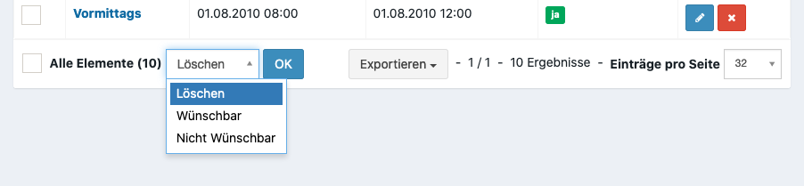

Vorbereitungen für Verleih
==========================

Inventartypen anlegen
---------------------

Inventartypen dienen zur Unterscheidung von Fahrzeugen (z.B. PKW oder Transporter) und Inventar (z.B. Werkzeugkasten, Rucksack). Neue Typen können über **Verleih > Inventartypen** angelegt werden.

:Typ:
    Inventar hat wenige Metadaten.

    Fahrzeuge haben weitere Metadaten wie Kennzeichen, Fabrikat oder Besatzung. Invetar und Fahrzeuge werden über verschiedene Bereich in der Verwaltung gepflegt.

:Registrierung:
    :Anfang / Ende:
        Zeitraum in dem sich Teilnehmer ein Gegenstand als Interessent anmelden können

    :Hinweistext:
        Hinweistext der bei der Fahrzeuganmeldung angezeigt werden soll

    :Bearbeitung:
        Steuert, ob ein Teilnehmer im Nachhinein seine Fahrzeuganmeldung bearbeiten kann

(Optional) Führerscheinklassen anlegen
--------------------------------------

In diesem Bereich sollten nie Anpassungen vorgemommen werden. Führerscheinklassen sind weitere Metadaten für ein Fahrzeug.

Schichten anlegen
-----------------

Schichten sind Zeitslots in dem ein Fahrzeug bzw. Inventar zur Verfügung steht. Schichten stehen für alle Inventartypen zur Verfügung. Es gibt keine typenspezifischen Schichten.

.. _rental_shift:

Manuell
~~~~~~~

Die manuelle Anlage sollte nur in Ausnahmefällen oder zur Nachbearbeitung verwendet werden. In der Regel sollte mit der :ref:`rental_shift_batch` neue Schichten angelegt werden..

Unter **Verleih > Schichten** kann eine neue Schicht angelegt werden.

:Startdatum:
    Erstes Datum für das eine Schicht angelegt werden soll.

:Enddatum:
    Letztes Datum an dem eine Schicht angelegt werden soll.

:Wünschbar:
    Legt fest, ob ein Teilnehmer diese bei der Anmeldung auswählen kann oder ob dieses nur durch einen Manager erfolgen kann.

:Wunschlimit:
    Legt fest wie viele Teilnehmer sich diese Schicht wünschen können. Kann verwendet werden um Überbelegungen einzelner Schichten zu vermeiden.

.. _rental_shift_batch:

Massenanlage
~~~~~~~~~~~~

Um mehrere gleichartige Schichten für eine Veranstaltung anzulegen kann das **Batch Erstellung** Tool unter **Verleih > Schichten** verwendet werden.

Beschreibung der einzelnen Felder, siehe :ref:`manuelle Anlage <rental_shift>`.

Neben den fachlichen Feldern gibt es für die Massenanlage zwei technische Felder:

:Tag:
    Relative Differenz zu dem Datum. Sollte in der Regel immer 0 sein, außer eine Schicht beginnt sehr spät oder erstreckt sich über mehrere Tage.

:Uhrzeit:
    Uhrzeit der Schicht

.. note::

    Wird als Startdatum der 01.08.2020, als Enddatum der 10.08.2020, als Schichtanfang Tag 0 und 20:00 und als Schichtende Tag 1 und 03:00 Uhr gewählt, so werden insgesamt 10 einzelne Schichten erstellt.

    Die erste Schicht beginnt am 01.08.2020 10:00 Uhr und endet am 02.08.2020 03:00 Uhr. Die letzte Schicht beginnt am 10.08.2020 10:00 Uhr und endet am 11.08.2020 03:00 Uhr.

.. _rental_shift_post_edit:

Schicht Nachbearbeitung
~~~~~~~~~~~~~~~~~~~~~~~

Sollen nach der Anlage Werte verändert werden, kann dieses über die Nachbearbeitung erfolgen. Im unteren Menü der Übersicht können eine oder mehrere Schichten bearbeitet werden.

Feldbeschreibung siehe :ref:`Manuelle Anlage von Schichten <rental_shift>`.
