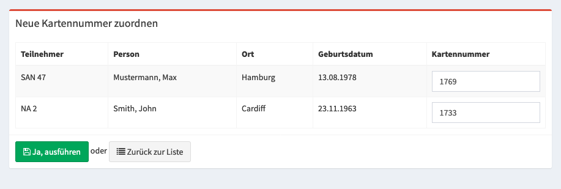

Prüfung von Personalbewerbungen
===============================

Für die Prüfung von Personalbewerbunge gibt es mehrere Schritte. Zum einen können die Nachweise der Helfer überprüft werden und zum anderen können die Schichtwünsche für einen Teilnehmer angenommen werden.

Prüfung von Bewerbungen
-----------------------

Unter **Personal > Personalplaner** lassen sich alle Schichtwünsche von Teilnehmer überprüfen, sowie neue Schichten zugeordnet werden. Über die Filterung lässt sich die Menge der sichtbaren Wünsche eingrenzen.

In der Darstellung gibt es grüne und orange Blöcke. Die organge Farbe signalisiert einen Schichtwunsch, grün signalisiert eine genehmigte Schicht.

Mit einen Klick auf **Bearbeiten** wird der Manager Modus aktiviert. Mit einen linken Mausklick auf eine grüne (genehmigte Schicht) wird diese orange (als Wunsch) gewechselt. Dieses geschieht in beide Richtungen.
Mit einem rechten Mausklick auf eine Schicht kann die Schicht durch eine andere ersetzt werden. Mit einem rechten Mausklick auf eine leere Zelle kann eine komplett neue Schicht zugeordnet werden.

Prüfung von Nachweisen
----------------------

Alle hochgeladenen Nachweise lassen sich unter **Benutzer > Nachweis Schnellprüfung** in Masse überprüfen und freischalten.

Kartennummern hinzufügen
------------------------

Je nach Einstellung der Veranstaltung (siehe :ref:`Automatische Kartennummern <general_topic>`) lassen sich entweder automatisch neue Kartennummern generieren, wenn die Codes in den Kartenlayouts dargestellt werden oder manuell neue Kartennummer setzen. Dieses kann über das untere Menü der Übersicht (**Veranstaltung > Teilnehmer**) erfolgen.

Manuelle Zuordnung
~~~~~~~~~~~~~~~~~~

Für die Zuordnung kann entweder ein Barcode Scanner verwendet werden, sofern dieser nach jedem Scan ein Return Signal sendet oder dieses manuell eingegeben werden.

.. note::

    Sollte eine Nummer doppelt eingegeben werden, wird eine Warnung beim Speichern angezeigt und die Nummer für diesen Inventargegenstand übersprungen.

Statistiken
-----------

Für die Planung gibt es mehrere Statistiken:

Nachweise
~~~~~~~~~

Alle hochgeladenen Nachweise lassen sich unter **Personal > Teilnehmer Nachweise** als Liste überprüfen um fehlende oder abgelaufene Nachweise zu finden.

Schicht Statistik
~~~~~~~~~~~~~~~~~

Unter **Personal > Statistik** lassen sich die Anzahl der Teilnehmer für eine Schicht und Datum herausfinden. An dieser Stelle wird auch das Ziel einer Schicht (siehe :ref:`Soll <personal_shift>`) berücksichtigt.

Einsatzplanung
~~~~~~~~~~~~~~

Wie viele Teilnehmer einem Einsatzort zugeordnet ist lässt sich unter **Personal > Einsatzplanung** herausfinden. Damit eine Person einem Einsatzort zugeordnet werden kann, muss der Teilnehmer an diesen Tag eine Schicht absolvieren.
