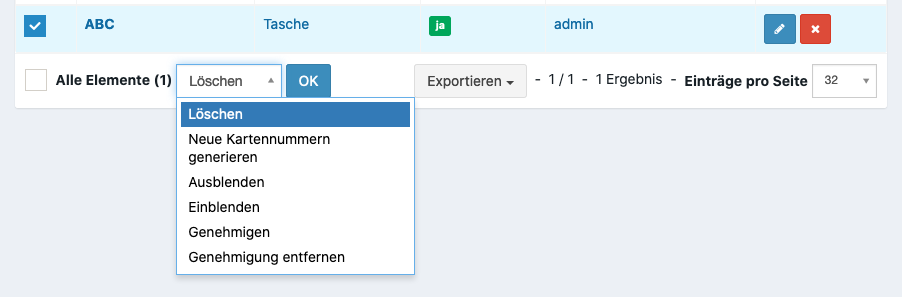
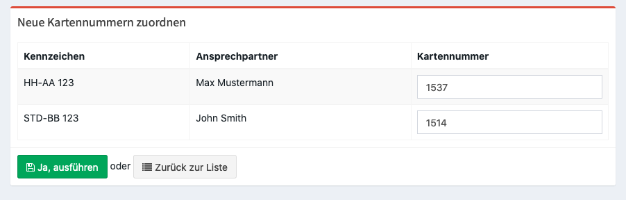

Prüfung von Verleih Bewerbungen
===============================

Prüfung von Bewerbungen
-----------------------

In der Verwaltung kann das Inventar unter **Verleih > Inventar** bzw. die Fahrzeuge unter **Verleih > Fahrzeuge** bestätigt werden.

Sollen mehrere Fahrzeuge bzw. Gegenstände auf einmal bestätigt werden, kann dieses im unteren Menü der Übersicht bearbeitet werden.

Kartennummern hinzufügen
------------------------

Je nach Einstellung der Veranstaltung (siehe :ref:`Automatische Kartennummern <general_topic>`) lassen sich entweder automatisch neue Kartennummern generieren, wenn die Codes in den Kartenlayouts dargestellt werden oder manuell neue Kartennummer setzen. Dieses kann über das untere Menü der Übersicht (**Verleih > Inventar bzw. Fahrzeuge**) erfolgen.

Manuelle Zuordnung
~~~~~~~~~~~~~~~~~~

Durch Drücken von Return wird in das nächste Feld gewechselt.

.. note::

    Um die Nummern schneller zuzuordnen kann auch ein Barcode Scanner verwendet werden. Dieser muss nach jeden Scan allerdings ein Return Befehl mitsenden. werden.

.. note::

    Sollte eine Nummer doppelt eingegeben werden, wird eine Warnung beim Speichern angezeigt und die Nummer für diesen Inventargegenstand übersprungen.

Statistiken
-----------

Über **Verleih > Verfügbarkeiten** kann eine Übersicht über alle eingereichten und bestätigen Inventargegenstände angezeigt werden.
